<p align="center">
  
</p>

<div align="center">

```bash
lucas@github:~$ whoami
> Ingeniería en Computación · Data Analyst · Automation · Cybersecurity (Learning)

lucas@github:~$ focus
> Data Analysis · Process Automation · AI Workflows

lucas@github:~$ status
> OPEN TO WORK ✓ | LEARNING: Always
```

</div>

---

## 🧠 SYSTEM OVERVIEW

<div align="center">

| 🎯 Focus | 🤖 AI | 🛡️ Cyber | 🌍 Location |
|--------|------|---------|-----------|
| Data & Automation | Workflows | Learning (Blue Team) | Uruguay 🇺🇾 |

</div>

---

## 👤 ABOUT ME

Soy estudiante de **Ingeniería en Computación** con enfoque en:

- 📊 **Análisis de Datos**
- 🤖 **Automatización de procesos (Make, APIs, bots)**
- 🛡️ **Ciberseguridad en formación (Blue Team)**

---

## 🧠 CURRENT FOCUS

```bash
1. Data Analysis + Automation + AI Workflows
2. Cybersecurity fundamentals (Blue Team path)
3. Building real-world projects
```

---

## 🛠️ TECH STACK

### 📊 Data & Automation
Python · Pandas · Make · APIs

### 💻 Systems
Linux · Git · Networking

### 🛡️ Cybersecurity (Learning)
Wazuh · Splunk · SIEM

---

## 🚀 PROJECTS

| Proyecto | Descripción | Stack |
|--------|------------|------|
| QrSocAnalyzer | Análisis automatizado de QR maliciosos | Python |
| cybersecurity-journey | Documentación de labs | Kali |
| EasyFood UY | App full-stack | Python |
| Telegram → Sheets | Automatización | APIs |

---

## 📜 CERTIFICATIONS

| Certificación | Estado |
|--------------|--------|
| Google Cybersecurity Certificate | ✅ |
| SOC Level 1 | 🔄 |
| Cisco Networking | ✅ |
| Security+ | 🎯 |

---

## 📊 STATS

<p align="center">
  
</p>

---

## 📫 CONTACT

- Email: lucasrfcapilla.1b2015@gmail.com  
- LinkedIn: https://www.linkedin.com/in/lucasreyes2003/  
- Portfolio: https://lucasreyesgithub.github.io/lucasreyes.github.io/

<p align="center">
  
</p>
